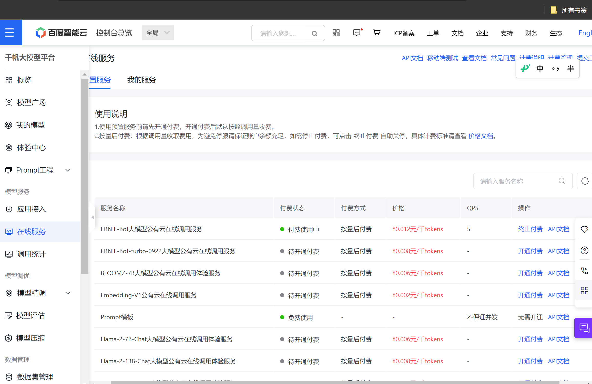
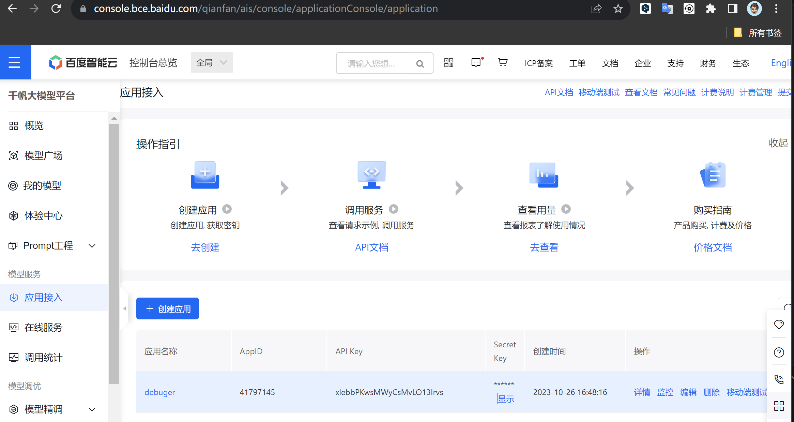

# DebugThinker-python-UI

一个基于百度千帆大模型平台的快速代码报错诊断工具，能帮助初学者快速解决代码问题，提高学习效率。

## 原项目

原命令行版本：[https://github.com/Gloridust/DebugThinker-python](https://github.com/Gloridust/DebugThinker-python)  
原命令行版本已停止更新与维护，新版本具有以下优势：

- 更友好的图形化交互UI界面，使用更便捷
- 支持多行换行输入，能解决多行代码

## 开始使用

### 获取API

1.注册并 登录 [百度千帆大模型平台控制台](https://console.bce.baidu.com/qianfan/ais/console/onlineService) 在“在线服务”区域，开通“ERNIE-Bot大模型公有云在线调用服务”。

2.在“应用接入”处创建应用，得到API_KEY和SECRET_KEY并保存好。

### 配置程序

1.将同目录下的[example.config.py](./example.config.py)重命名为[config.py](./config.py)文件

2.将刚刚获得的API_KEY和SECRET_KEY填入[config.py](./config.py)并保存。